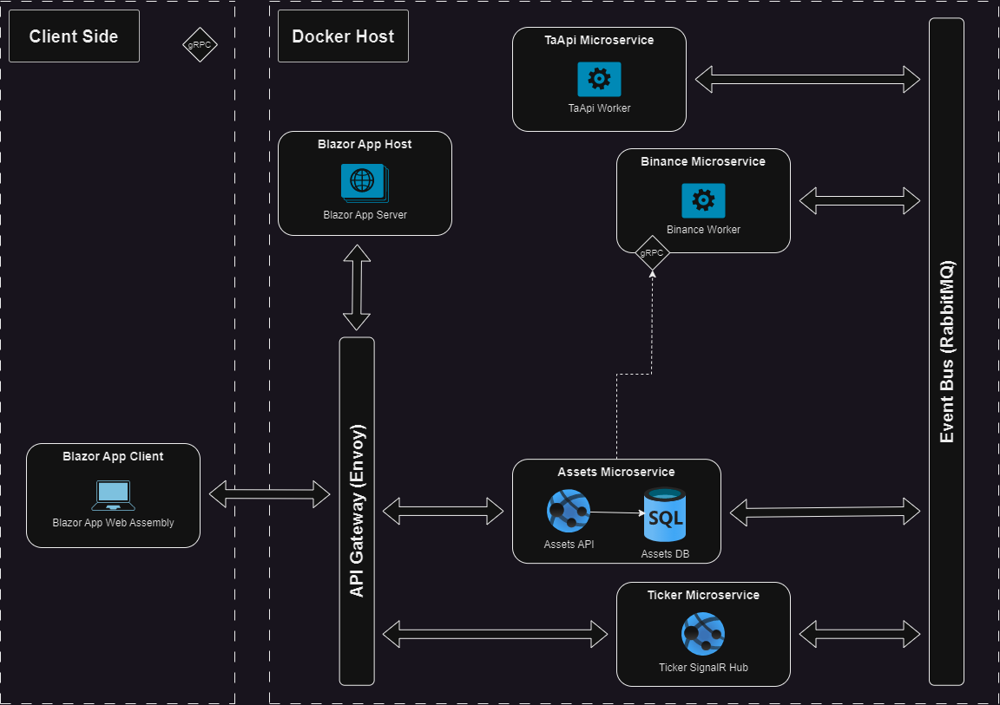

# Trading Suite
A simple system for convenient trading, based on a microservices architecture and Docker containers.

## Current State (the system is under development)

 - Only Cryptocurrencies from Binance platform are supported
 - The system doesn't support trading yet

## Getting Started

The system can be easily started using docker-compose or Kubernetes

## Architecture

The system is built using a microservices-oriented architecture with multiple autonomous microservices. Each microservice is dedicated to a specific task. Microservices communicate with each other using asynchronous messages over the event bus (RabbitMQ). All synchronous communications are done via gRPC. Envoy is used as API Gateway to shield all microservices and it allows access to only specific microservices (Web API).

